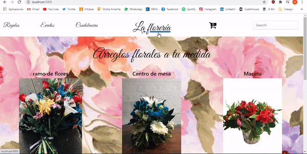

# Flores Carlitos

Flores Carlitos es una aplicación ecommerce para el rubro floral realizado con React js. Fue desarrollado con [Create React App](https://github.com/facebook/create-react-app). Su funcionamiento va desde la selección de los productos y su cantidad hasta llenar un formulario para generar la orden de compra que será almacenada en firestore. 

## Levantar app

Escribir en la terminal  `npm start`  
Levantar en [http://localhost:3000](http://localhost:3000/) para verla en el browser.  
La página se recargará si la actualizas.

## Librerías

Es necesario descargar los módulos de Firebase para poder llevar adelante el proyecto. La versión usada es 7.19.1.  
También es necesario descargar react-router-dom.  
A pesar de usar Bootstrap, no es necesario descargarlo puesto que se usó mediante link y scripts en el archivo html. 

## Cómo debería verse

